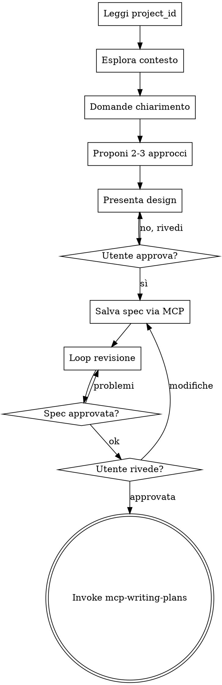

# MCP Brainstorming

Variante MCP-native di `superpowers:brainstorming`. Stesso processo di esplorazione collaborativa, ma la spec viene salvata nel Manager AI MCP — **nessun file .md su disco**.

**Announce at start:** "Sto usando mcp-brainstorming per esplorare il design e creare la spec via Manager AI."

<HARD-GATE>
NON scrivere codice, non fare scaffolding, non invocare skill di implementazione prima di aver presentato il design e ricevuto approvazione dall'utente.
</HARD-GATE>

## Prerequisito: project_id

Leggi `manager.json` nella root del progetto per il `project_id` richiesto da tutti i tool MCP.

## Checklist

Crea un task per ogni voce e completale in ordine:

1. **Leggi project_id** da `manager.json`
2. **Esplora contesto progetto** — file, struttura, commit recenti; usa `mcp__ManagerAi__get_project_context`
3. **Fai domande di chiarimento** — una alla volta; scopo, vincoli, criteri di successo
4. **Proponi 2-3 approcci** — con trade-off e raccomandazione
5. **Presenta il design** — sezione per sezione, chiedi approvazione dopo ogni sezione
6. **Salva spec via MCP** — `mcp__ManagerAi__create_task_spec`
7. **Loop revisione spec** — dispatcha subagent revisore; correggi e ri-dispatcha fino ad approvazione (max 3 iterazioni)
8. **Chiedi revisione all'utente** — comunica il task_id della spec, attendi approvazione
9. **Transizione a mcp-writing-plans** — invoca la skill per il piano

## Flusso



## Salvataggio Spec

```
mcp__ManagerAi__create_task_spec
  project_id: <da manager.json>
  content: <spec completa in markdown>
```

Dopo aver salvato:
> "Spec salvata nel Manager AI (task_id: `<id>`). Controllala nell'interfaccia e dimmi se vuoi modifiche prima di passare al piano."

## Principi

- **Una domanda per volta**
- **Preferisci scelta multipla**
- **YAGNI** — rimuovi feature non necessarie
- **Esplora sempre 2-3 approcci**
- **Validazione incrementale** — presenta, ottieni approvazione, poi avanza
