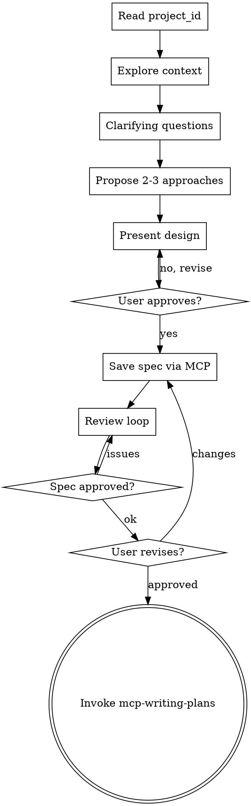

# MCP Brainstorming

MCP-native variant of `superpowers:brainstorming`. Same collaborative exploration process, but the spec is saved via Manager AI MCP — **no .md files on disk**.

**Announce at start:** "Using mcp-brainstorming to explore the design and create the spec via Manager AI."

<HARD-GATE>
DO NOT write code, scaffold, or invoke implementation skills before presenting the design and receiving user approval.
</HARD-GATE>

## Prerequisite: project_id

Read `manager.json` in the project root for the `project_id` required by all MCP tools.

## Checklist

Create a task for each item and complete them in order:

1. **Read project_id** from `manager.json`
2. **Explore project context** — files, structure, recent commits; use `mcp__ManagerAi__get_project_context`
3. **Ask clarifying questions** — one at a time; scope, constraints, success criteria
4. **Propose 2-3 approaches** — with trade-offs and a recommendation
5. **Present the design** — section by section, ask for approval after each section
6. **Save spec via MCP** — `mcp__ManagerAi__create_task_spec`
7. **Spec review loop** — dispatch reviewer subagent; fix and re-dispatch until approved (max 3 iterations)
8. **Request user review** — share the spec task_id, wait for approval
9. **Transition to mcp-writing-plans** — invoke the skill for the plan

## Flow



## Saving the Spec

```
mcp__ManagerAi__create_task_spec
  project_id: <from manager.json>
  content: <full spec in markdown>
```

After saving:
> "Spec saved in Manager AI (task_id: `<id>`). Review it in the interface and let me know if you want changes before moving to the plan."

## Principles

- **One question at a time**
- **Prefer multiple choice**
- **YAGNI** — remove unnecessary features
- **Always explore 2-3 approaches**
- **Incremental validation** — present, get approval, then advance
