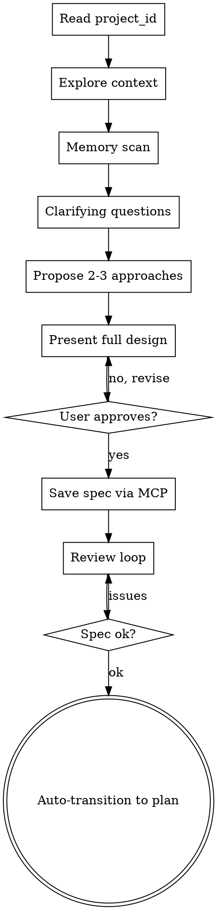

# MCP Brainstorming

MCP-native variant of `superpowers:brainstorming`. Same collaborative exploration process, but the spec is saved via Manager AI MCP — **no .md files on disk**.

**Announce at start:** "Using mcp-brainstorming to explore the design and create the spec via Manager AI."

<HARD-GATE>
DO NOT write code, scaffold, or invoke implementation skills before presenting the design and receiving user approval.
</HARD-GATE>

## Prerequisite: project_id

Read `manager.json` in the project root for the `project_id` required by all MCP tools.

## Checklist

Create a task for each item and complete them in order:

1. **Read project_id** from `manager.json`
2. **Explore project context** — files, structure, recent commits; use `mcp__ManagerAi__get_project_context`
3. **Memory scan (MUST)** — `mcp__ManagerAi__memory_search` with topic keywords and `mcp__ManagerAi__memory_list(project_id, parent_id="")` for root memories; surface any prior decisions, constraints, or user preferences before asking clarifying questions
4. **Ask clarifying questions** — one at a time; scope, constraints, success criteria
5. **Propose 2-3 approaches** — with trade-offs and a recommendation
6. **Present the design** — present the full design in one shot, then ask for a single overall approval. Do NOT ask for approval section by section.
7. **Save spec via MCP** — `mcp__ManagerAi__create_task_spec`
8. **Spec review loop** — dispatch reviewer subagent; fix and re-dispatch until approved (max 3 iterations)
9. **Notify and proceed** — share the spec task_id briefly, then auto-transition to mcp-writing-plans. Do NOT wait for the user to review or approve the spec — the design approval at step 6 is the only user gate.

## Flow


```dot
digraph mcp_brainstorming {
    "Read project_id" [shape=box];
    "Explore context" [shape=box];
    "Memory scan" [shape=box];
    "Clarifying questions" [shape=box];
    "Propose 2-3 approaches" [shape=box];
    "Present full design" [shape=box];
    "User approves?" [shape=diamond];
    "Save spec via MCP" [shape=box];
    "Review loop" [shape=box];
    "Spec ok?" [shape=diamond];
    "Auto-transition to plan" [shape=doublecircle];

    "Read project_id" -> "Explore context";
    "Explore context" -> "Memory scan";
    "Memory scan" -> "Clarifying questions";
    "Clarifying questions" -> "Propose 2-3 approaches";
    "Propose 2-3 approaches" -> "Present full design";
    "Present full design" -> "User approves?";
    "User approves?" -> "Present full design" [label="no, revise"];
    "User approves?" -> "Save spec via MCP" [label="yes"];
    "Save spec via MCP" -> "Review loop";
    "Review loop" -> "Spec ok?";
    "Spec ok?" -> "Review loop" [label="issues"];
    "Spec ok?" -> "Auto-transition to plan" [label="ok"];
}
```

## Saving the Spec

```
mcp__ManagerAi__create_task_spec
  project_id: <from manager.json>
  content: <full spec in markdown>
```

After saving:
> "Spec saved in Manager AI (task_id: `<id>`). Moving to implementation plan now."

## Principles

- **One question at a time**
- **Prefer multiple choice**
- **YAGNI** — remove unnecessary features
- **Always explore 2-3 approaches**
- **Incremental validation** — present, get approval, then advance
